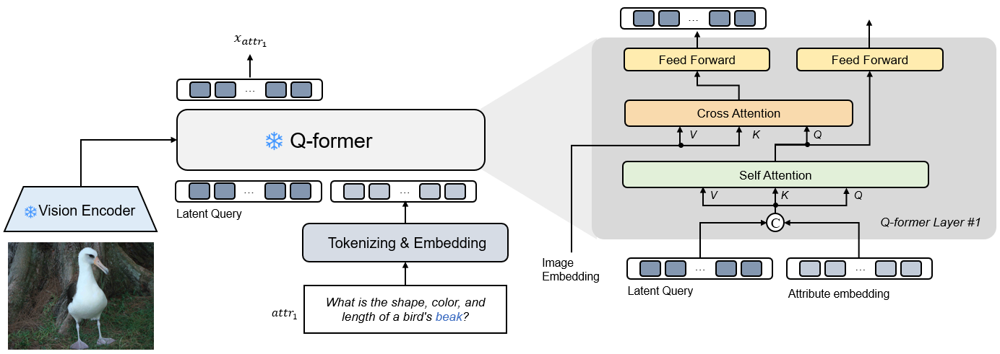
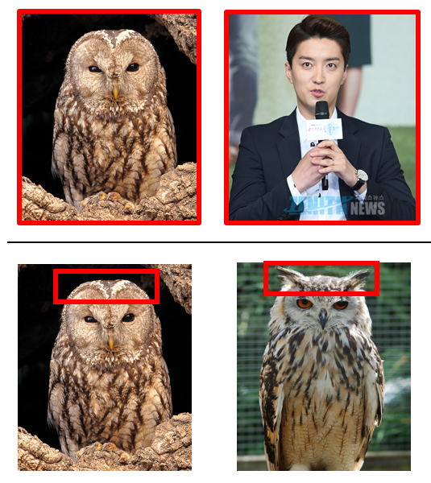

# :fire: FIRE 

**23.09.04 ~ 23.12.15**  
Team project in Computer Vision (AIGS539)

    

### **1. Motivation**

    

- Our work is motivated by the human cognitive approach, where individuals tend to focus on specific attributes rather than the entire image when making comparisons.  
- For example,  when measuring the similarity between two objects, humans typically begin by comparing coarse attributes like the overall color and shape of the objects. Subsequently, they shift their attention to finer features, such as the ears of a bird, especially when a coarse-grained observation fails to clearly distinguish between them.

### **2. Contribution**

1. We introduce a cutting-edge approach in the form of attribute-aware prompt-based zero-shot image retrieval
2. We offer a detailed guide for fine-grained prompt-based image retrieval, examining performance across different prompt designs.

### **3. Demo**  

1. Prepare environment
	- We conducted our experiments using Python 3.9 on an A100-80G GPU.
	- `pip install -r requirements.txt`
2. Enter your desired prompt into a text file `<attribte file path>`
3. Modify the `attributes_path` and `num_attributes` arguments in the `infer.sh` file
4. Run `infer.sh`

### **🌻 Contributor**

<table>
  <tr>
    <td align="center"><a href="https://github.com/aqaqsubin"> <b>Subin Kim</b></td>
    <td align="center"><a href="https://github.com/jonghwi-kim" width="125" height="170"> <b>Kim Jonghwi</b></td>
  </tr>
</table>

